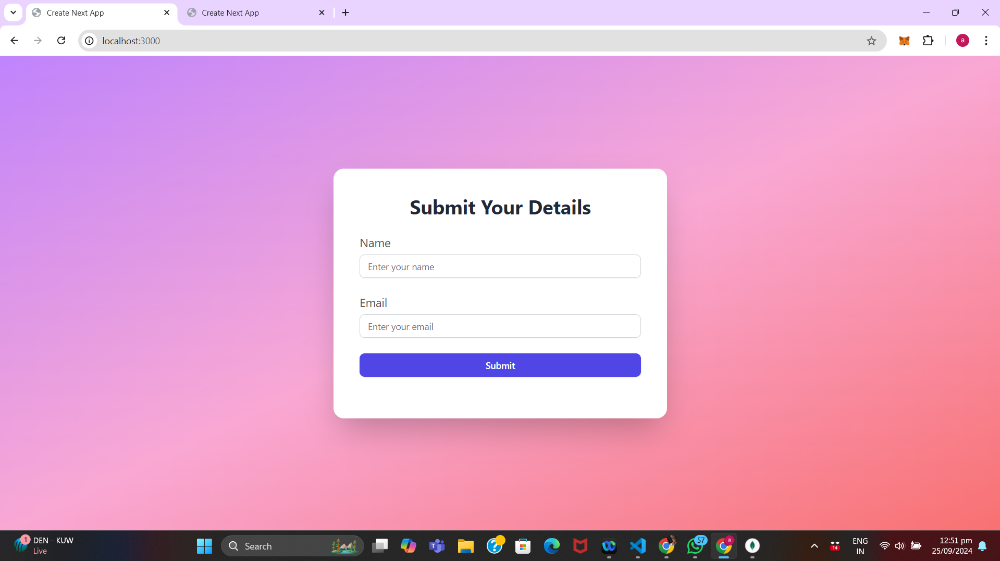
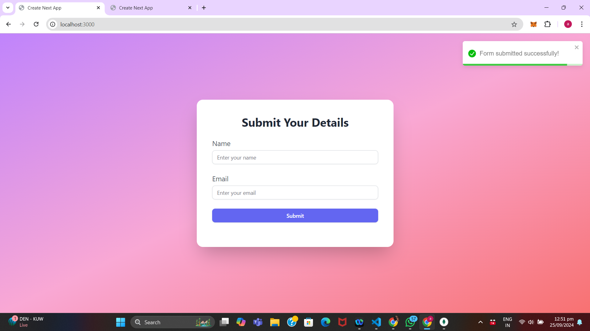

# Next.js Form Submission with Shadcn, Tailwind CSS, and MongoDB

This project is a simple form submission application built using **Next.js**, **Shadcn UI components**, **Tailwind CSS** for styling, and **MongoDB** for the backend database. Users can submit their details (name and email), and the form data will be stored in a MongoDB database.

## Features
- Responsive form UI built with **Shadcn** components and **Tailwind CSS**.
- Gradient background with smooth color transitions for a modern look.
- Form submission with loading state and error handling.
- Form data stored in **MongoDB** using Next.js API routes.
- Toast notifications for successful or failed submissions.

## Tech Stack

- **Next.js** - React framework for server-side rendering and static site generation.
- **Shadcn** - UI components library integrated with Tailwind CSS.
- **Tailwind CSS** - Utility-first CSS framework for fast UI development.
- **MongoDB** - NoSQL database used to store the form data.
- **React Toastify** - Library for displaying notifications.

## Prerequisites

Before running the project, make sure you have the following tools installed:

- [Node.js](https://nodejs.org/) (v14 or later)
- [MongoDB](https://www.mongodb.com/) (Local or Cloud MongoDB instance)

## Getting Started

### 1. Clone the Repository
```bash
git clone https://github.com/your-repo/next-shadcn-mongodb-form.git
cd next-shadcn-mongodb-form
```

## Install Dependencies
Make sure you're in the project directory and run the following command to install the necessary packages:
```bash
npm install
```
## Set Up Environment Variables
Create a `.env.local` file at the root of the project and add your MongoDB URI:
```bash
MONGODB_URI=mongodb+srv://<username>:<password>@cluster0.mongodb.net/<dbname>?retryWrites=true&w=majority
```

## Run the Development Server
To start the Next.js development server, run the following command:
```bash
npm run dev
```
This will start the application at`http://localhost:3000`

## API Endpoints
### POST /api/submit
1) Description: Submits the form data (name and email) to MongoDB.
 - Method: POST
- Request Body:
- name: string
- email: string
- Response:
- Success: { success: true, data: ... }
- Error: { success: false, message: ... }

## Troubleshooting
### Common Issues
1) MongoDB Connection Error: Ensure that your `MONGODB_URI` in the `.env.local` file is correct. You should use your MongoDB connection string from MongoDB Atlas or a local instance.

2) Module Not Found Errors: Make sure all required packages are installed by running `npm install` and verify that your import paths are correct.

## Screenshot 




